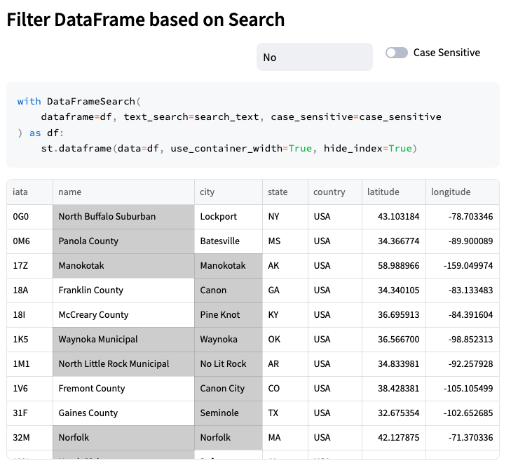

# DataFrame Global Search

This library will create a search grid for your Pandas DataFrame. If a match is found, a styled dataframe will be returned with matching columns highlighted. 

## PyPi Project
You can access the PyPi project [here](https://pypi.org/project/df-global-search/)
## Installation 
```shell
pip install df-global-search
```

## Available Arguments

|Arg|Type|Default Value|
|---|---|---|
|dataframe|pd.DataFrame||
|text_search| str| None|
|case_sensitive|bool|False|
|match_font_color|str|black|
|match_background_color|str|lightgray|

## Usage (with Streamlit)
``` python
from df_global_search import DataFrameSearch

with DataFrameSearch(
        dataframe = df,
        text_search: 'hello',
        case_sensitive: bool = False
) as df:
    st.dataframe(df, use_container_width=True)
    
```


## Sample

