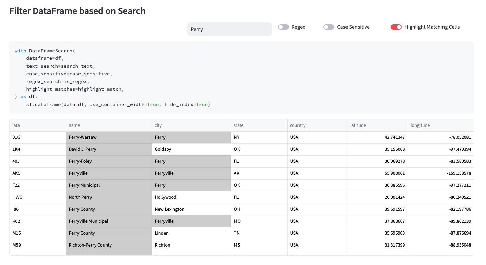
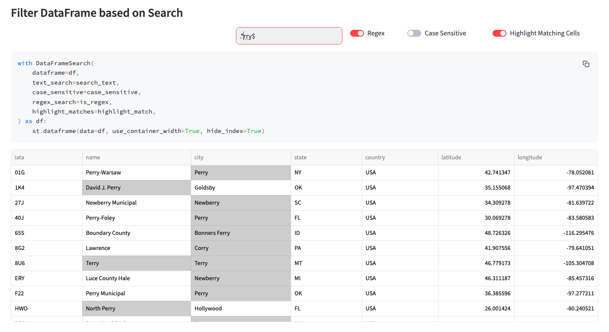

# DataFrame Global Search

This library will create a search grid for your Pandas DataFrame. If a match is found, a styled dataframe will be returned with matching columns highlighted. Search can be performed using Text or Regular Expressions. 

## PyPi Project
You can access the PyPi project [here](https://pypi.org/project/df-global-search/)
## Installation 
```shell
pip install df-global-search
```

## Available Arguments

|Arg|Type|Default Value|Optional|
|---|---|---|---|
|dataframe|pd.DataFrame||🚫|
|text_search| str| None|✅|
|highlight_matches|bool|True|✅|
|regex_search|bool|False|✅|
|case_sensitive|bool|False|✅
|match_font_color|str|black|✅|
|match_background_color|str|lightgray|✅|

## Usage (without Streamlit)
``` python
from df_global_search import DataFrameSearch

with DataFrameSearch(
        dataframe=df,
        text_search='hello',
        case_sensitive=False
) as df:
    df.show()
    
```
## Usage (with Streamlit)
>To use interactive widgets with this library, please create widgets such as text_input for search and checkboxes or toggles for boolean arguments like shown on the example below.

``` python
import streamlit as st
from df_global_search import DataFrameSearch

#df=pd.dataframe <- define your data

#Widgets to interact with library
search_bar_columns = st.columns((2, 1, 0.5, 0.75, 1))
with search_bar_columns[1]:
    search_text = st.text_input(
        "Search", label_visibility="collapsed", placeholder="Search Text"
    )
with search_bar_columns[2]:
    is_regex = st.toggle("Regex", value=False)
with search_bar_columns[3]:
    case_sensitive = st.toggle("Case Sensitive", value=False)
with search_bar_columns[4]:
    highlight_match = st.toggle("Highlight Matching Cells", value=True)

with DataFrameSearch(
    dataframe=df,
    text_search=search_text,
    case_sensitive=case_sensitive,
    regex_search=is_regex,
    highlight_matches=highlight_match,
) as df:
    st.dataframe(data=df, use_container_width=True, hide_index=True)

```


## Sample

### Regular Search


### Regex Search


